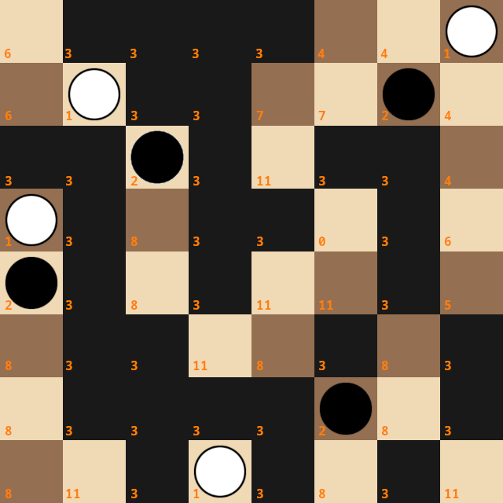

# Amazons

Amazons move has 2 'stages', move the queen and then shoot the arrow from the queen in queen-like movement. This leads to high branching factor of several hundred moves per ply. Some engines divide those stages in their search, but for simplicity I do not. My features for the network involve many floodfilling of queen movements, which is fast because I use bitboards. White queen is 1, black queen is 2, arrow is 3. As for the empty squares, first I calculate the movements of the queens in distance one move and two moves. Distance from the queen along the orthogonals and diagonals is 1, and distance from those distances is 2. How to use this information sounds a little complicated for me to describe it, so I write the relevant code:

```C++
getInputs() {
  // a is distance in 1 move, a2 in 2 moves, for white
  uint64_t a = generateReachableSquares(oneBoard);
  uint64_t a2 = generateReachableSquares(a|oneBoard);
  // b is distance in 1 move, b2 in 2 moves, for black
  uint64_t b = generateReachableSquares(twoBoard);
  uint64_t b2 = generateReachableSquares(b|twoBoard);
  
  for (int i=0; i < 64; i++) {
    uint64_t p = 1ULL << i;
    int index = 0;
    if (oneBoard&p) {
      index = 1;
    } else if (twoBoard&p) {
      index = 2;
    } else if (arrows&p) {
      index = 3;
    } else {
      bool A = (a&p) != 0;
      bool B = (b&p) != 0;
      bool A2 = (a2&p) != 0;
      bool B2 = (b2&p) != 0;
      if (A&B) {
        index = 4;
      } else if (A) {
        index = B2 ? 5 : 6;
      } else if (B) {
        index = A2 ? 7 : 8;
      } else if (A2&B2) {
        index = 9;
      } else if (A2) {
        index = 10;
      } else if (B2) {
        index = 11;
      }
    }
  }
}
```

There are 12x64=768 inputs for the network.


