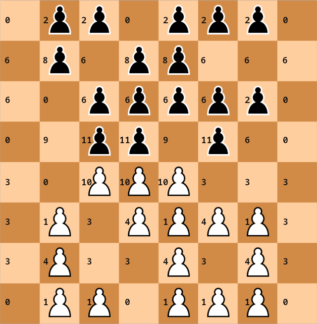

# Breakthrough

## Former

This was second game when I practiced NN and was succesful in it. At the time my learning framework was quite different, and I used to use minimax (alpha-beta) for training. Many changes occurred since then.

For breakthrough I used to have more complicated inputs. Each square, aside from being empty, black pawn or white pawn, each square could also be attacked, protected or both. So the indexes for each square goes like this: 0 - empty, 1 - white, 2 - black, +3 if square attacked by white pawn, +6 if square attacked by black pawn. And +12 if side to move was black. Yes, in the old times I had different inputs for the side to move, effectively doubling parameters and wasting precious space. It was at the times when I just learned how to utilize NNs and backpropagation values seemed simple then, less wrong sign errors to occur.

So there were 24x64=1536 inputs (a little less because for example white's home row can't be attacked by white pawns). The network distinguished protected and attacked pawn from unprotected one. This came from my standard eval, where I would penalty attacked unprotected pawn and it was winning more. Up to 6 squares could be changed per move. I used 48 hidden units in 1 hidden layer. It was winning 100% against any non-NN bots at the time. Not much changed until others started using NNs as well and crushed me. Later I added second hidden layer, it was slower but slightly better. In the meantime I used neural networks in other games, evolving my learning framework and search algorithms.

In the above image we can see the indexes of the contents of squares. If this is black to move, add 12 to each index.

## Present

Then after some hiatus I decided to rewrite breakthrough learning framework. I decided to test simple inputs. White and black pawns only. So 128 inputs, but because due to extended solver, no my pawns in enemy home row and no enemy pawn in my home row will ever be used in the network, so there are effectively 112 inputs. For black to move, instead of doubling the inputs, I rotate the board by 180 degress and switch white and black pawns. Because using rotation, if there is my pawn below enemy home row and because this is my move, then I win, so no need for encode my pawns below enemy home row as well. So the network has 104 inputs in total. Because they wasted much less space, I could use bigger hidden layer. 

And lo and behold, those inputs are better than my old complicated one. It required at least 320 hidden nodes, but because 2, at most 3 inputs change per move, the speed decrease didn't occur. Moreover, less time is spent extracting features from position. And the more hidden units in the layer, the better it played. As of writing this article, I have 720 hidden units, 1 hidden layer in breakthrough.

As you can see, sometimes simpler is better. I learned a lot and changed my learning methodology several times. Some things have to be revised, perhaps they are no more needed. For example TD-Gammon utilized additional features in its inputs, but [more recent experiments show](http://www.scholarpedia.org/article/User:Gerald_Tesauro/Proposed/Td-gammon#Performance_Results) they may have been not needed after all.
