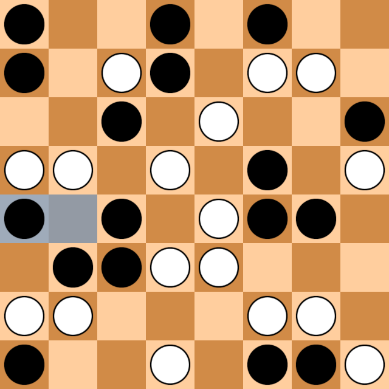

# Clobber

Raw inputs that take into account white and black stones were weak, to say the least. Talking with people, the conclusion is that for evaluation in clobber you should take the adjacent stones into account. So I did. For each stone I take into consideration it's orthogonal neighbours. One could think of them as plus-shaped n-tuples, almost. You have black or white stone at the center, and 4 neighbours with one of three states (white, black or empty). If the center is empty, I don't add the n-tuple into inputs. That gives 2x3^4=162 inputs per square, and 64 squares give 162x64=10k inputs (a little less for edges and corner), thus the net is tiny in terms of hidden layer size. Similarly to connect 4 and yavalath, I took some work to make feature extraction and partial updates efficient. My bot leads with a little margin. It's surprising, because the scores for the moves he shows are often very misleading. If it wins, it wins. But whenever losing game, the bot often gives over 90% chance to win just to prove loss in the next move. I believe this is probably due to the very small size of the network, in terms on its internal representation. That and big branching factor so it doesn't see deep into the future.

