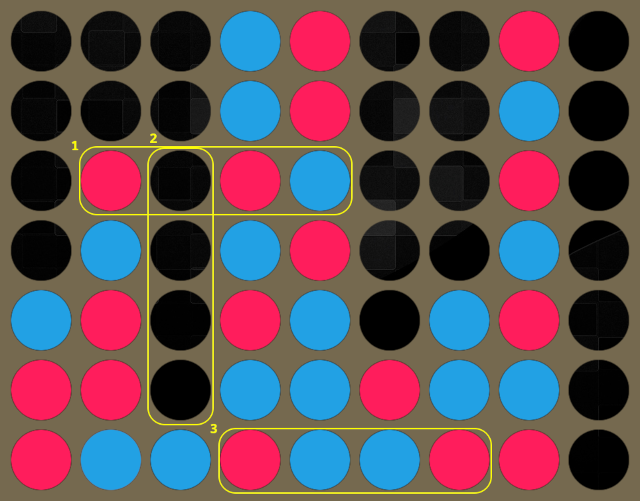

# Connect 4

My kind of failed attempts: simple inputs for red, blue. Some experiments for using empty for inputs as well. It did learn something and it was even much better than my pure mcts. But testing networks was frustrating. Many overfitting occurred between networks, next iteration could beat previous one in 70% games, or lose 80% games. I could upload bot that won against my best in 75% games, but be much lower in the leaderboard. When analyzing some positions manually, I found that it could think that having 3-in-row (blocked from 2 sides!) meant it was almost winning. I think in connection games, simple one-hots introduce too much noise for the net. Maybe the problem is in my learning, or learning the net, maybe I should use some tricks like regularization or filter positions to learn better.

CNN (convolutional neural network) seems a natural choice, but I have never done them, they are relatively slow to learn and inference so probably I would need to change my search algorithm accordingly as well. I decided to experiment more with my usual approach.

Experiment: add "dead" disc to inputs. In some positions it doesn't matter if disc is blue or red - it can't form any 4-in-row anymore. If we mask those and just use dead discs as another input, it should denoise the inputs, especially in almost full positions, right? 

```
211221.11    xxxxx1.11
122122.22    xxxx22.22
112211.21    xxxxx1.xx
221112.12 => xxxx12.xx
211221.11    xxxx21.11
122112.22    xxxxx2.22
212212111    xxxxxx11x
```

Well, that was not the case, at least not as much as I hoped. The net learned better, there was less overfitting but any benefits were thwarted by calculating those additional discs and there were more changes per move.

Success: N-tuples. Those are used in N-Tuple Neural Network, which is efficient memory-based neural network, usually without hidden layers. Extensively used in [othello](https://arxiv.org/abs/1406.1509), or standard [connect-4](https://www.researchgate.net/publication/235219697_Reinforcement_Learning_with_N-tuples_on_the_Game_Connect-4). N-tuples can have various shapes, for connect 4 I use every 4-in-row tuples. Those will be the inputs for my neural network. They are very sparse, take a lot of space, but they are very fast to calculate. There are 126 4-in-rows, and each 4-in-row can have 1 of 3^4=81 values, so 126x81=10206 inputs. Quite big, thus hidden layer has to be very small. With 8 hidden units, there are already around 80k weights, so 20k characters left for actual code. I had to be creative on how to efficiently extract the 4-tuples from position, and how to get only those changed during a move. There are at most 10 changed 4-tuples during move. Given the net is relatively small computionally, more time is spent on other parts of the search than NN inference.

Nevertheless, it was big success. Almost every new iteration was better than previous one, and I was confident that when locally bot was better than the others, it will be higher in the leaderboard. I managed to learn to save 2 weights per 1 utf16 char, albeit with less precision, so right now my net in connect 4 has 16 hidden units thus arund 160k weights. Locally I trained much bigger net, with 64 hidden units and it is much better, winning over 70% games, but due to codesize limit I can't upload it. Maybe one day I will use it as teacher network and try some knowledge distilation methods. Possibilities for experimentation are vast. One way think of N-tuples as a poor man's convolutional neural network.



There are 126 4-tuples in connect 4, overlapping horizontal, vertical and diagonal. Index of tuple 1 from the image is 1012(3)=32, tuple 2 is 0000(3)=0, tuple 3 is 1221(3)=52.


# Yavalath

This is similar to connect 4. Simple inputs for red and blue were not successful. Of course it was better than pure mcts, but nowhere near the thing I have now. Just like in connect 4, I use 4-tuples in yavalath. This was easy because I already used the pattern to check for wins and loses. There are 102 4-in-rows in yavalath, thus 102x81=8262. With 16 hidden units thats 132k weights (66k chars) and this is the net uploaded to leaderboard.

Interestingly, it is less susceptible to early traps even without booking - when it loses, it is in 18+ rounds, not as early as 12 then even with booking. Again, I have trained bigger network which is much better but I can't upload it due to size limit.