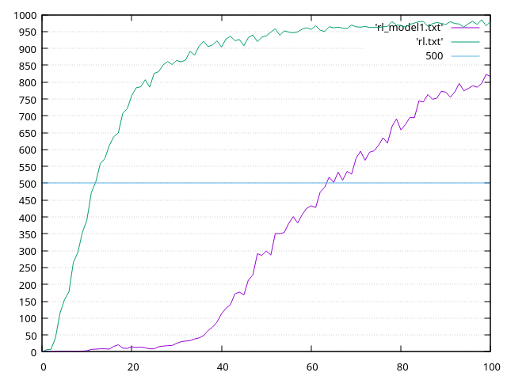

# Hex

The newest board game added to CG. For this one I use simple encoding, 1 blue or 2 end. With 121 cells that gives total 242 inputs. Even if the game is recent and very few serious competition has arrived, I see my bot is strong judging seeing it at the top of leadeboard (at the time of writing). I'm surprised it works so well after all. The game is spatial with global connection as the goal. Simple inputs didn't work in connect4 or yavalath, which would care only for local patterns, but here the network plays competent games.

But still I can see some serious blindness. Whenever my bot loses, it gives much score, even something like 99% win to the preceding moves, just before solving the game as loss. This often happens when his path is almost complete, except for the fact that it is completely blocked by the opponent. Well probably the same cells were activated in other situations during self-play games when he often won. How to tackle those blindness, wether by adding to the inputs the distances from floodfill, or wether by improving my training framework is something I plan to do in the future.

Now there is some important thing to note. When switching side, I used to switch reds and blues only. At the beginning it learned very slowly and I thought it would be bad like in the case of connect4 or yavalath. But the learning did occur and it played good after all. But when switching sides I also rotated the board by 90 degrees... the learning skyrocketed.

X-axis is iteration, each iteration consists of several thousands of training games. Y-axis is winrate of very quick games against pure mcts. Purple is without rotated board, green is with rotated board.

Seeing this, I question the reality. Why it worked at all then when I didn't rotate the board!? What other *subtle* bugs are hiding?
