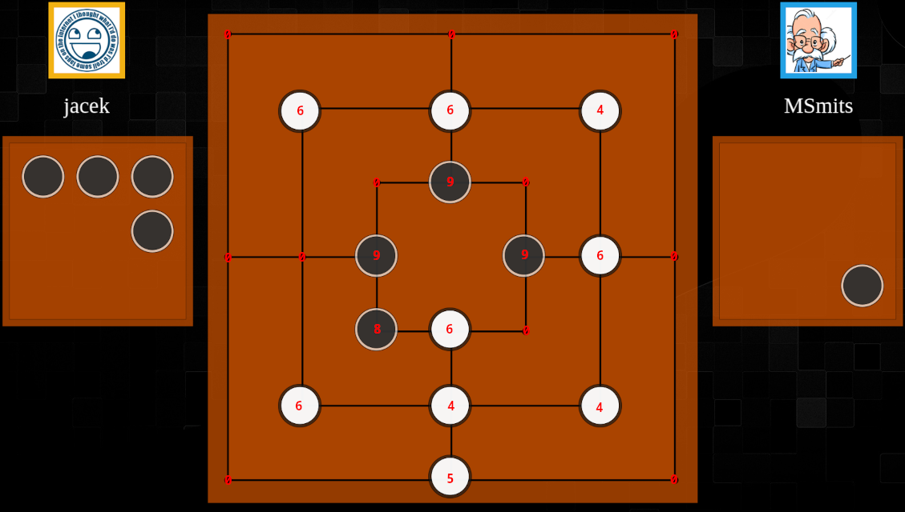

# Nine Men's Morris

Nine Men's Morris has 3 phases: **placing phase**, **moving phase** and **flying phase**, all depending on how many of the player's stones are on board. In this game each player can be in different phase individually. Naturally I will account for those phases in my inputs. But also I'll account wether the stone is 'blocked' (can't move), 'free' (has at least 2 free adjacements) or just normal, except for flying phase because stone can be moved anywhere. The indexes for each dot goes like this: in **placing phase** 1 (blocked) 2 (free) 3 (normal) for white stones and 8 (blocked) 9 (free) 10 (normal) for black stones, in **moving phase** 4 (blocked) 5 (free) 6 (normal) for white stones and 11 (blocked) 12 (free) 13 (normal) for black stones, in **flying phase** is 7 for white stones and 14 for black stones. 0 is for empty. 15x24 = 360 inputs.

Left player (white) has already placed all his stones and he is in moving phase. Right player (black) is still in placing phase.

This is from my early NN experimentation and I didn't touch this game since then. I believe with my improved learning framework and searching, the simpler inputs would work just as well, just like it was the case with the breakthrough.
