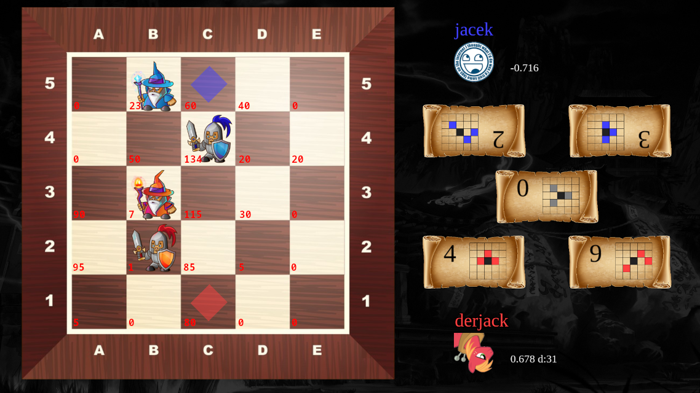

# Onitama

Onitama's pieces movements depend entirely on the 5 randomly selected cards out of 16 cards. Getting pawns and masters from the 5x5 board is straightforward, but I wondered how to incorporate the cards into to network. I tried separately add them to the inputs but the results were mediocre at best. I tried some 'bucketing' for the sake of experiment, that is using board as input for each combination of cards separately. But of course I abandoned this idea because there are 131k cards combinations. I did what is similar to other board games. I treated pawns, masters, empty squares as something different depending on the target of cards. I'll try to explain, because again the inputs are complicated, but they do work.

The index on each square can be 0 - empty, 1 - red pawn, 2 - red master, 3 - blue pawn, 4 - blue master. From the players' cards, the squares can be attacked, by pawn or master or both. I add +5 if attacked by red pawn, +10 if attacked by red master, +20 if attacked by blue pawn, +40 if attacked by blue master. As for the center card, because the current player (red) will get it after his turn, I assume the current player will attack from center card. And I combine attacks from pawn and master. So I add +80 if the square is attacked using center card by red pawn or master. When changing side to move, I rotate the board by 180 degrees. Also I don't forget to switch the cards as well, nasty bugs everywhere.

Red to move. There are 160 possible indexes per square overall, but because some of them are impossible (i.e. red master can't be attacked by himself), instead of 160x25=4000, there are 3168 inputs to the net. 

I have to keep my hidden layer small, so the NN inference cost is relatively small. Much computation goes from extracting those indexes from the board. I experimented with various combinations, merging pawn and master attacks, or separating center card attack by pawn and master. Some quickly, some more thoroughly, and this is the above result. As of now, my bot is 1st in the leadeboard with significant lead. For some reason, from all the games I have bots for, I'm especially proud of this one.
