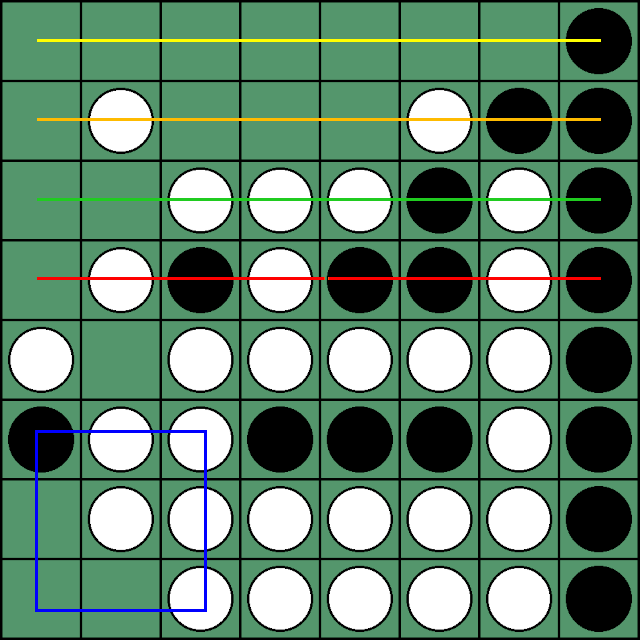
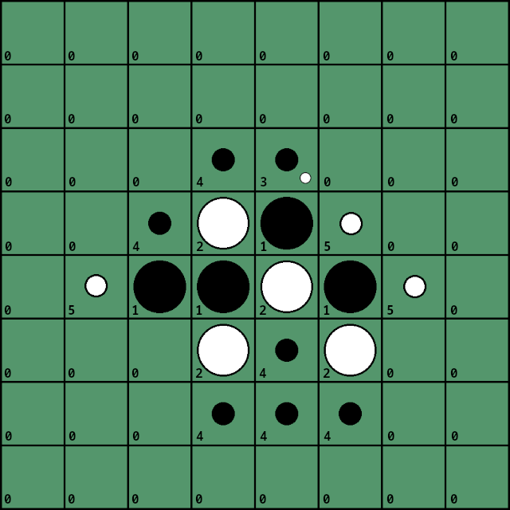

# Othello

## History

History: [N-Tuple Neural Network](https://repository.essex.ac.uk/3820/1/NTupleOthello.pdf), N-tuples patterns: 4 8-in-row, 1 3x3 corner and their symmetries. Added other features: number of discs, number of frontier discs (discs next to empty space), number of my possible moves and number of enemy possible moves if he were to move. No hidden layer, the network was just perceptron. It was incredibly fast to learn and inference. My bot was among the top. In my first attempts to use neural network, simple one-hots failed miserably, as predicted. Long N-tuples naturally capture distant interdependent features, simple one-hots do not, at least not without special tricks.

Four 8-in-rows, 1 3x3 corners. Plus their symmetries and rotations: 16 8-in-rows (8 horizontal, 8 vertical), 4 3x3 corners. Additional feature inputs: 16 black discs, 29 white discs, 5 black frontiers, 13 white frontiers, 10 black moves, 5 white moves. Despite white having more discs, this is very bad situation for white.

When side to move is white: switch black and white stones, don't forget switching moves as well, so the net thinks it's first player. Weights size: 3^9=20k, 4x3^8=26k, + 6 from other features; around 46k total.

## Present

Taking ideas from common features used in othello, each square can be: empty, black normal stone, white normal stone, black frontier stone, white frontier stone, black&white potential moves, black potential move, white potential move. Frontier disc is one next to empty square. So either 7 or 8 states per square if you count empty square as well, which for now I do. At this point I don't know if having empty in inputs helps or hurts, but I'm not motivated yet to do extensive tests. So there are 8x64=512 inputs. And it works! It is much better than hiddenless n-tuple network. 160 hidden units, so around 82k weights. I'm not motivated yet train 2x bigger network which would probably be better. But maybe if some better bot appears on the leaderboard...

But this is not the net I have uploaded. I did test other set of inputs, the one without frontier discs, so 6x64=384 inputs and 240 hidden units. It appears the strength is similar to the above net. Maybe frontier discs isn't that important feature that should be done separately.

In the above image we can see the indexes of the contents of squares (without the frontier discs inputs).

Another feature to test in the future would be stable discs, the ones that can't ever be flipped. But again I'm not motivated enough, too lazy or too dumb to write efficient code that would calculate those stable discs exactly. Once again, I'm waiting for someone to beat me.
