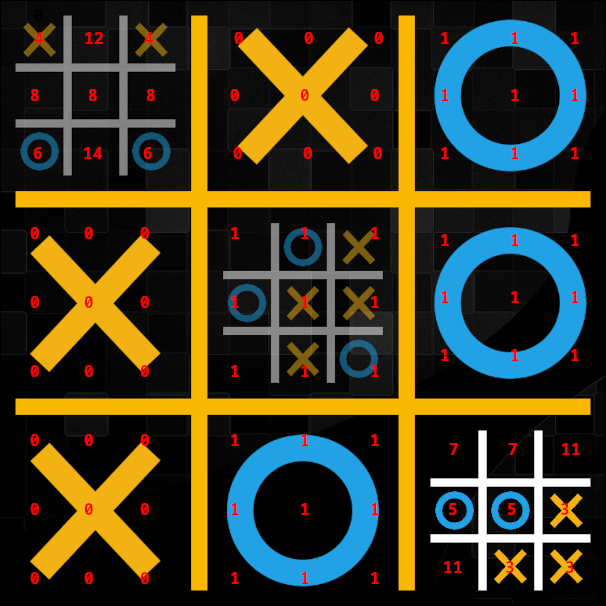

# Ultimate Tic Tac Toe

UTTT resisted my attempts to NN it for quite long time. One thing was I had already put much effort into improving mcts enhancements for UTTT, so further improvements would be harder to achieve. Another thing was I needed to improve my learning framework and pipeline, as well the inputs and efficient feature extraction from the position. But I won the battle, the NN is much stronger than the mcts ever was. There are 15 possible states for each square (I take empty into account). 81x15=1215 inputs. I did some caching to get them efficiently, as well to calculate the partial difference.

Instead of describing the input, I'll provide the code. The code for getting the features goes like this, per miniboard:

```c++
vector<int> getInputs(bool isToMoveBoard) {
  vector<int> inputs(9);
    for (int i=0; i < 9; i++) {
      if (isOver()) {
        int w = getWinner();
        inputs[i] = w == PLAYER_X ? 0 : w == PLAYER_O ? 1 : 2;
      } else {
        int p = 1 << (i%9);
        if (p&gameState) { // it is X
          inputs[i] = isToMoveBoard ? 3 : 4;
        } else if (p&(gameState>>9)) { // it is O
          inputs[i] = isToMoveBoard ? 5 : 6;
        } else {
          makeMove(PLAYER_X,i%9);
          bool wouldXWin = isOver(); // if X were to move here, it would won the miniboard
          undoMove(PLAYER_X,i%9);
          makeMove(PLAYER_O,i%9);
          bool wouldOWin = isOver(); // if O were to move here, it would won the miniboard
          undoMove(PLAYER_O,i%9);
          if (wouldXWin&&wouldOWin) {
            inputs[i] = isToMoveBoard ? 9 : 10;
          } else if (wouldXWin) {
            inputs[i] = isToMoveBoard ? 11 : 12;
          } else if (wouldOWin) {
            inputs[i] = isToMoveBoard ? 13 : 14;
          } else {
            inputs[i] = isToMoveBoard ? 7 : 8;
          }
        }
      }
    }
  return inputs;
}
```

As you can see, the inputs almost double wether this miniboard is active or not.



Looking back at it now, the inputs seem a little too complicated. For example no need to use 9 instead of 1 squares to indicate if miniboard is won or lost. I know some guys that use much simpler inputs and achieve good results.
